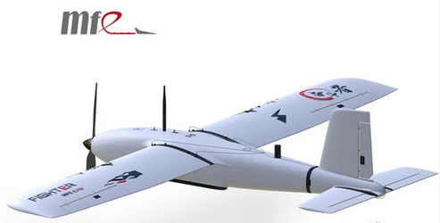
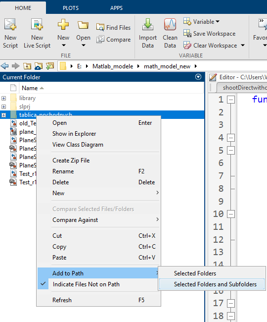
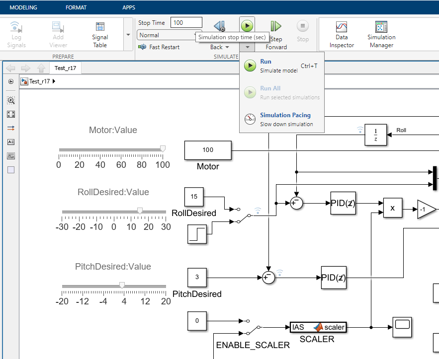
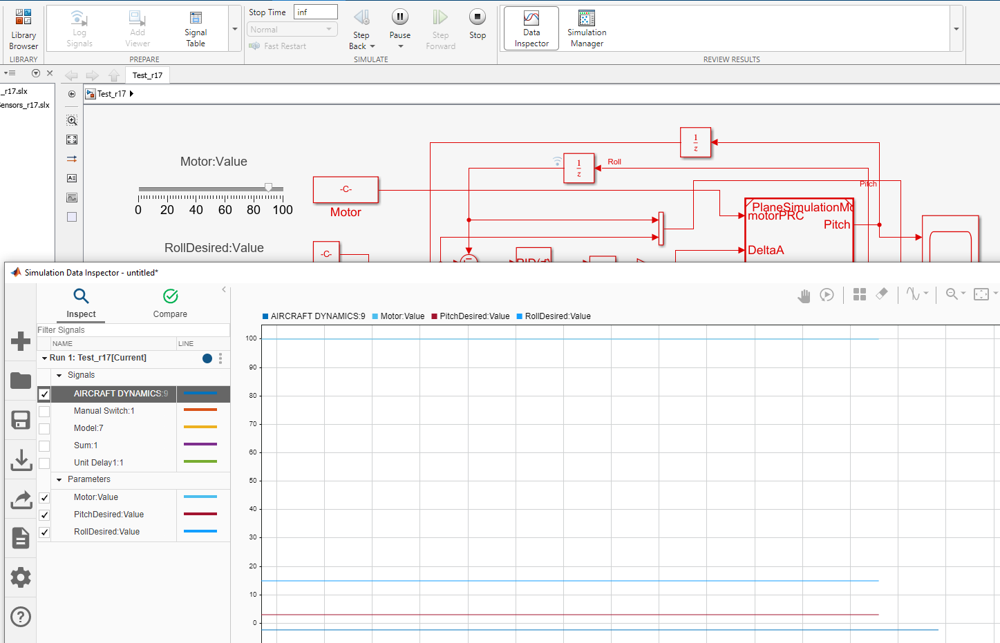

# UxV-Models
The UAVConfigurator software allows users to simulate the behavior of the Fighter UAV platform, a commercial solution available online. 
The test platform was the Fighter UAV, which is commercially available (https://rcdrone.top/products/makeflyeasy-fighter-2430mm-fixed-wing-aircraft).

To use the UAVConfigurator software to construct their own aerodynamics models, download the prepared packages from the repository, for example in a zip file format. 

After downloading the repository, unzip them in a selected directory. 

To run the software, you must have a MATLAB and Simulink license (the software was tested using version MATLAB2022). After launching the MATLAB environment, navigate to the directory containing the models and append the model subdirectories to the main model. 

Next, launch the Simulink environment. After launching Simulink, open the test_r17 project. The example allows users to run their own simulations of a system for which a sensor model has been added, such as a magnetometer or GPS. The example models are located in one of the blocks of the main Simulink model. 
Before running the model, specify the simulation length in seconds. If the "inf" value is entered, the simulation will be terminated upon user request. 

[Read model description](documentation/README.md)

