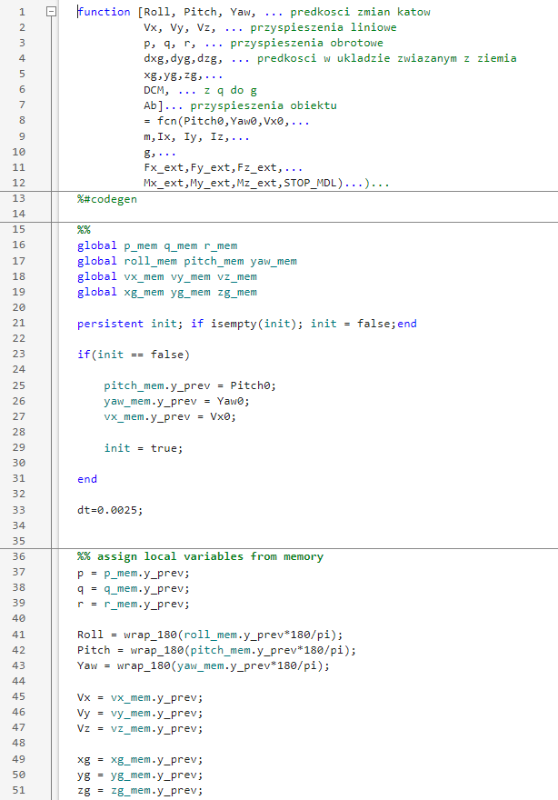
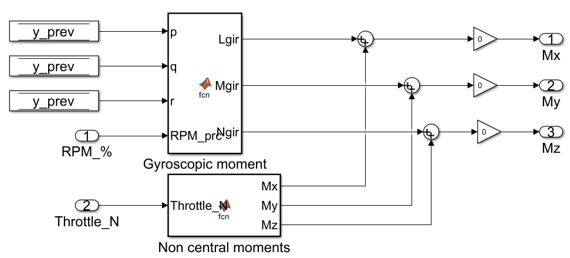
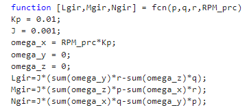
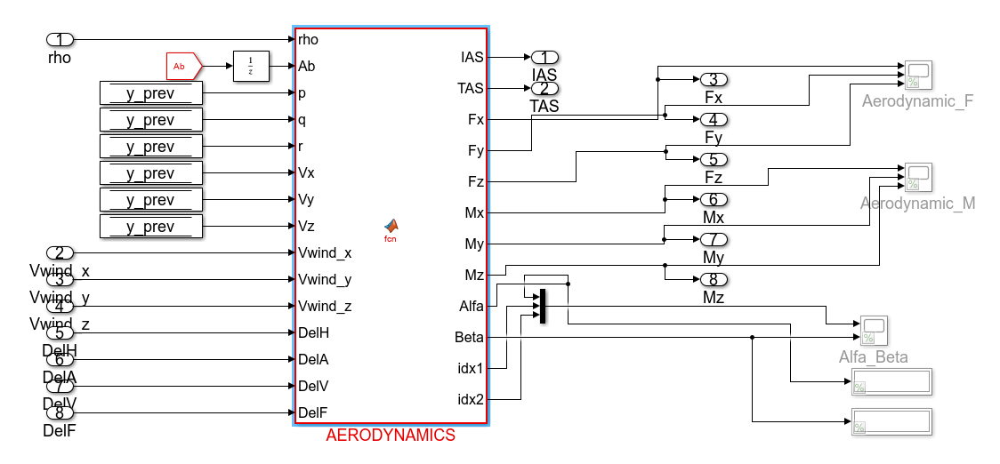
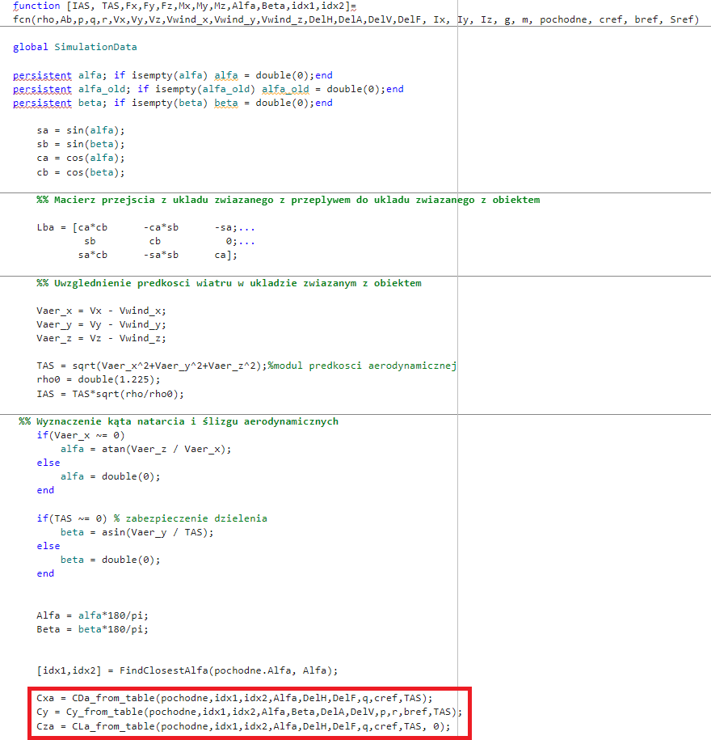
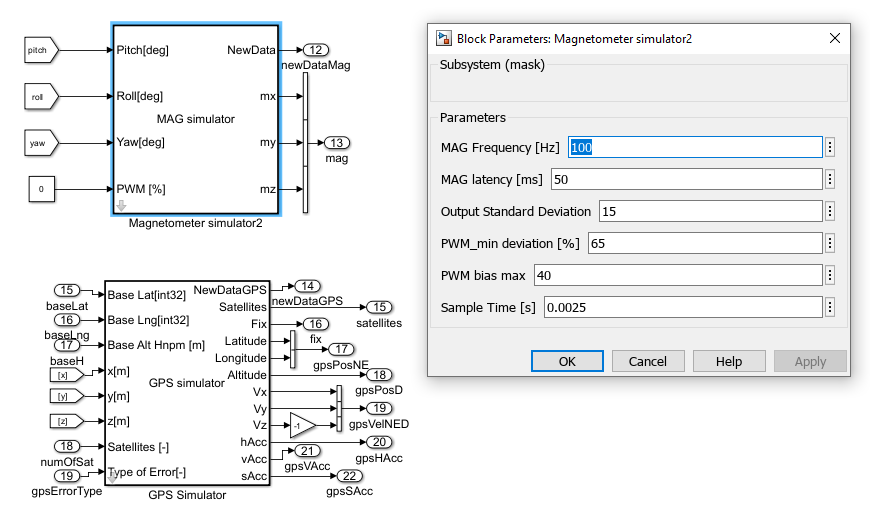

# Model components description

UAVConfigurator is software designed for simulating the dynamics of a Commercial Off-The-Shelf (COTS) Fighter UAV airframe, developed in the MATLAB/Simulink environment. This application simplifies the process of designing and testing control software for unmanned systems. It serves as a Software-In-the-Loop (SIL) simulator, allowing users to build and test new algorithms in simulated environments before transitioning to real UAVs. 

The software accurately reflects actual UAV dynamics, which have been verified through flight tests. It includes models of essential UAV components and enables users to simulate sensor failures. Additionally, it features an ISA atmosphere model. Users have the flexibility to modify the models of each component.

A plane simulation model consisting of two main parts: UAV aerodynamics component and Mathematical model of the UAV. Aerodynamics and Motor components calculate forces and moments acting on the UAV. Mathematical 6-DOF model updates the position of the UAV at each time step.
The aerodynamics model developed for the airframe allows users to simulate UAV operations without needing to independently calculate force and moment values, making it a unique tool in UAV simulation.

Detailed platform dynamics models are described in the article https://www.mdpi.com/1996-1073/15/10/3730. 
Formulas (1)-(19) demonstrate methods for determining changes in the platform's position due to changes in forces and moments acting on the platform. 

The Simulink model includes software that determines the values of forces and moments acting on the platform, without which the simulation does not reflect the actual behavior of the platform during flight. This element, determined for the Fighter UAV platform, is the most important and unique element of the work. To modify sensor parameters, MATLAB software packages or models available online can be used. The wind gust model is also available in one of the MATLAB toolboxes.

The values ​​of forces and moments acting on the platform are determined in the MOTOR MOMENTS and AERODYNAMICS blocks. The structure of the MOTOR MOMENTS block, which determines the moment values ​​for the electric motor used on the platform, is shown below. These values ​​are corrected by the AERODYNAMICS block.

Function implementations in MATLAB are available for modification by the system user.

The UAVConfigurator software implements all the necessary functions to calibrate the Fighter UAV system so that it can fly using manual control of the platform with minimal autopilot involvement.

The figure highlights in red the functions that correct the values ​​of forces and moments acting on the UAV, taking into account the platform parameters and the current telemetry vector. This element is a unique solution not available in other unmanned system models.

Due to the fact that the calculations are performed for a specific platform, the package code is not available for user modification.

The system model contains simplified blocks for simulating interference with on-board components affecting UAV flight. These blocks are located in the NAVIGATION SENSOR MODEL block. 
These primarily include IMU, GPS, and magnetometer models. 
The model's input is a set of state vector parameters, including the UAV's current position and the user input number of satellites from which the GPS receives data. The output is the UAV's position after correction for vertical and horizontal deviation errors and GPS latency in WGS84 format. 
Some sensor models can be found in MATLAB package.

